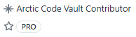

<h1 align="center">Hey there 👋, I'm Louis</h1>
<h3 align="center">Experienced Software Developer</h3>

  

- 🔭 I’m currently working on **Embedded development with microcontrollers**

- 🌌 Space & Science fanatic **https://github.com/louis-e/NANO-SAT-01**

- 🎮 Play my game on the Google Play Store [https://play.google.com/store/apps/details?id=com.cherryfactory.sortingbags](https://play.google.com/store/apps/details?id=com.cherryfactory.sortingbags)

- 📫 Reach me over **info@louisdev.de**

           

&nbsp;

